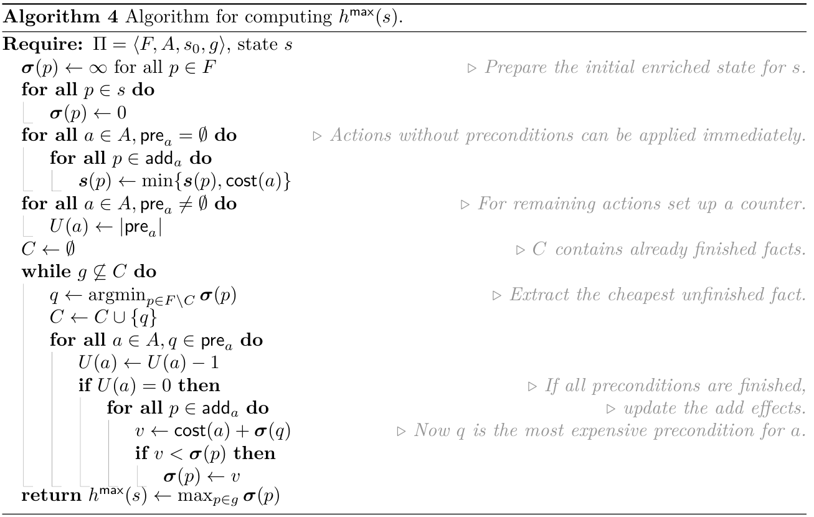
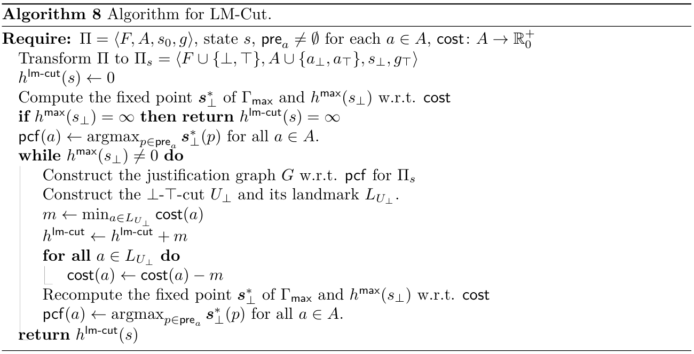

<div id="top"></div>


<!-- PROJECT LOGO -->
<br />
<div align="center">
  <h3 align="center">STRIPS Planner</h3>
</div>


<!-- TABLE OF CONTENTS -->
<details>
  <summary>Table of Contents</summary>
  <ol>
    <li>
      <a href="#about-the-project">About The Project</a>
      <ul>
        <li><a href="#built-with">Built With</a></li>
      </ul>
    </li>
    <li>
      <a href="#getting-started">Getting Started</a>
      <ul>
        <li><a href="#installation">Installation</a></li>
      </ul>
    </li>
    <li>
      <a href="#usafe">Usage</a>
    </li>
   <li>
      <a href="#heurestics">Heuristics</a>
      <ul>
        <li><a href="#hmax">Hmax</a></li>
        <li><a href="#lmcut">LmCut</a></li>
      </ul>
    </li>
  </ol>
</details>


<!-- ABOUT THE PROJECT -->
## About The Project

This project is an implementation of simple A* planner along with heuristics for delete-relaxation planning. 
The input files for the project were taken from: https://github.com/potassco/pddl-instances and converted into "[.sas](https://www.fast-downward.org/TranslatorOutputFormat)"
with [fast-downward](https://www.fast-downward.org/) planner.


### Built With

* [python3.9]()


<!-- GETTING STARTED -->
## Getting Started

To get a local copy up and running follow these example steps.

### Installation

1. Clone the repo
   ```sh
   git clone https://github.com/Matyxus/Python/planner
   ```
2. In folder where the project folder is located execute:
   ```sh
   pip install -e planner
   ```
   
<p align="right">(<a href="#top">back to top</a>)</p>

<!-- USAGE EXAMPLES -->
## Usage

Interaction with the project is defined trough command line by passing arguments, those are:
1. name of problem <ins>".sas"</ins> file (either full path, or just name if it is in [data](./data) directory)
2. name of the heuristic ([hmax](./src/heuristics/hmax.py) or [lmcut](./src/heuristics/lmcut.py))
3. name of the result file (i.e. the output of the planner -> actions and their total cost)

For this purpose there is the ["main.py"](./src/main.py) file, which implements planner by using
A*. Similarly, each heuristic can be used on its own with given problem file to get the heuristic cost of the initial state.


## Heuristics
There are 2 heuristics implemented in this project:

### Hmax


### LmCut
This heuristic has been implemented according to: [fast-downward planner](https://github.com/YannickZutter/fast-downward).



<p align="right">(<a href="#top">back to top</a>)</p>